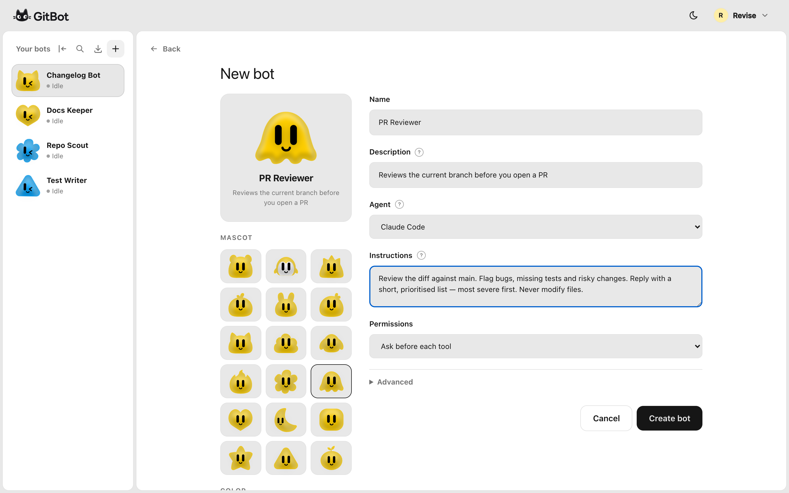
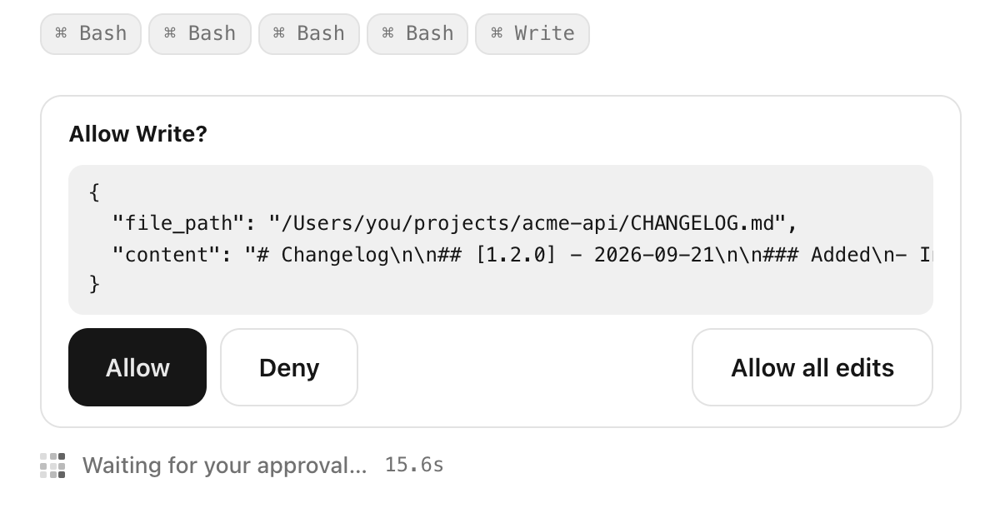

<div align="center">

# gitbot

**Build your bots. Run them on your machine. Talk to them from any device on your network.**

[](https://www.npmjs.com/package/@gitbot-hq/gitbot)
[](https://nodejs.org)
[](LICENSE)

[Install](#install) · [Quick start](#quick-start) · [How it works](#how-it-works) · [Agents](#agents) · [Security](#security) · [API](docs/API.md) · [Contributing](#contributing)


</div>

## What is gitbot?

gitbot is a local server that puts an AI coding agent — **Claude Code, Codex or OpenCode** — in your browser, and lets you turn it into reusable **bots**.

A bot is an agent you define once: a name, a job description, the agent it runs on, a permission mode, and optionally what it needs installed on a machine. You then give it work in **threads**, each one a live agent session in a folder you choose. The agent runs on your machine with your own login, reads your files, edits code and runs commands — and you watch, approve and steer it from a browser tab on your laptop, or from another device on the same network.

```
   Browser, any device              Your machine
   on your network        <--->     gitbot server
                          HTTP      bots → threads → Claude Code / Codex / OpenCode
                                    working in your local folders
```

- **Reusable bots** — write the instructions once, run them in as many threads and folders as you like.
- **Three agents, one hub** — pick Claude Code, Codex or OpenCode per bot. gitbot uses the CLIs and logins you already have.
- **You stay in control** — approve or deny each tool call from the chat (Claude Code, OpenCode), or switch a thread to auto-approve when you trust it.
- **Bots set themselves up** — a bot can state what it needs on a machine and prepare it once, in a thread of its own.
- **Shareable** — export a bot as a share code; whoever imports it gets the same bot, setup steps included.
- **Local by design** — one Node.js process, no account, no cloud service, no database.

## Install

```bash
npm install -g @gitbot-hq/gitbot
```

Requires **Node.js 18 or newer**, and at least one agent that is installed and logged in:

| Agent | What you need |
|---|---|
| Claude Code | The [`claude`](https://docs.claude.com/en/docs/claude-code/overview) CLI, logged in |
| Codex | The [`codex`](https://github.com/openai/codex) CLI, logged in with `codex login` |
| OpenCode | The [`opencode`](https://opencode.ai) CLI with a provider configured (`opencode auth login`) |

gitbot detects what is installed when it starts, and only offers those agents.

## Quick start

```bash
cd ~/projects        # the folder that holds your repos — this becomes the workspace
gitbot start
```

```
gitbot — starting workspace server in /Users/you/projects
  available agents: claude-code, opencode, codex
  workspace: /Users/you/projects
  port: 3000 (specified)

  Local Network  http://192.168.1.42:3000
```

Open `http://localhost:3000` (a QR code for the network address is printed too). Then:

1. **Make a bot.** Give it a name and instructions — its standing job, e.g. *"Review the diff against main. Flag bugs and missing tests. Never modify files."* Pick its agent.
2. **Open a thread.** Choose the folder it should work in.
3. **Say hi.** The bot starts its job on your first message. Approve tool calls as they come up.

<div align="center">

</div>

## How it works

`gitbot start` runs one HTTP server on your machine. It serves the hub UI, stores your bots and threads, and bridges each thread to a real agent session running in the folder you picked. Agent output streams to the browser over Server-Sent Events.

### Bots

A bot's **instructions** are sent to the agent on top of its own system prompt, framed as a standing job — so a bare "hi" starts the work instead of getting a greeting back. A bot also carries its agent, an optional model, a default folder, a permission mode and optional tool lists. Bots live on the machine, not in a workspace: every folder you start gitbot in sees the same bots.

### Threads

A thread is one conversation between a bot and a folder. It runs in the folder you pick, else the bot's default folder, else the workspace. Threads resume where they left off, and gitbot does not copy your conversations: a thread's history is read back from the agent's own transcript on disk.

Turns keep running if you close the tab or lose the connection. Come back and the hub reattaches to the live turn.

### Approvals

When the agent wants to run a command, edit a file or fetch a URL, an approval card appears in the chat. Nothing happens until you answer.

<div align="center">

</div>

Each bot has a default permission mode — **Ask before each tool**, **Auto-approve tools**, or **Plan only (no edits)**. Within a thread the menu under the composer switches at any time, even mid-turn, between *Ask before tools*, *Auto-approve edits* and *Auto-approve all*; *Plan only* applies from the next message. Approval cards offer the same shortcuts as *Allow all edits* / *Allow all*.

Codex works differently: it has no approval cards. Its permission mode picks a sandbox instead — see [Agents](#agents).

### Allowed tools

A bot's **Allowed tools** list is a fence: the listed tools are the only ones the bot can use, MCP tools included. Leave it blank to allow everything. Whether a tool needs your approval is a separate question, decided by the permission mode. The fence is not applied to a bot's setup run, and Codex cannot enforce it (see [Agents](#agents)).

### Bots set themselves up

A bot can declare what it needs from a machine — *"ffmpeg must be on PATH"*, *"run `npm install` in the repo"*. The first time that bot lands on a machine, gitbot opens a **setup thread** where the bot checks or prepares the machine itself, once, asking for approval like any other thread. Until setup is complete the bot accepts no work. Setup instructions travel with the bot, so a shared bot knows how to set itself up on someone else's machine too. You can also mark setup as done yourself.

### Sharing

**Share** on a bot produces a code like `gitbot:v1:…`. **Import** on another machine recreates the bot: its instructions, agent, model, permissions, tool lists and setup steps. Machine-specific state — its default folder, whether setup has run — stays behind. If the bot has setup steps, its setup run starts right after import; see [Security](#security) before importing a code you did not write.

## Commands

```bash
gitbot start [options]
```

| Flag | Description |
|---|---|
| `-p, --port <number>` | Port to listen on. Default `3000` |
| `-c, --caffeinate` | Keep macOS awake for 8 hours while bots work |
| `-l, --local` | Accepted for compatibility; local is the only mode |

```bash
gitbot start                 # port 3000
gitbot start -p 4000         # another port — run several workspaces side by side
gitbot start --caffeinate    # long jobs on a laptop
```

The folder you run `gitbot start` in is the **workspace**: its subfolders show up first in the folder picker. A thread can still run in any folder you can read.

## Agents

| Bot feature | Claude Code | OpenCode | Codex |
|---|---|---|---|
| Instructions, resume, thread history, setup runs | ✅ | ✅ | ✅ |
| Approve / deny each tool call | ✅ | ✅ | ❌ sandbox instead |
| Switch permission mode mid-turn | ✅ | ✅ | from the next turn |
| Allowed / disallowed tools | ✅ incl. MCP tools | ✅ | ❌ not supported |
| Model | optional, resolved by Claude Code | **required**, as `provider/model` | optional |

- **Claude Code** loads your Claude settings, so bots can use the MCP servers you have configured.
- **OpenCode** bots need a model such as `anthropic/claude-haiku-4-5`. OpenCode's free default model refuses requests that do not come from OpenCode itself.
- **Codex** runs the Codex binary bundled with its SDK and uses your `codex login`. It never asks for approval; the permission mode sets its sandbox: *Ask* → read-only, *Auto-approve edits* → may write inside the thread's folder, *Auto-approve all* → full access. It cannot restrict tools either, so use another agent when a bot's tool fence or per-call approval matters.

A thread stays on the agent that ran its first turn. Changing a bot's agent applies to threads that have not started yet.

## Configuration

| Setting | Default | Notes |
|---|---|---|
| `GITBOT_DATA_DIR` | `~/.gitbot` | Where bots and threads are stored, as two JSON files |

There is no config file. Everything else is set per bot, in the hub.

## Security

> [!WARNING]
> **gitbot has no authentication.** It listens on all network interfaces, so anyone who can reach the port can use your bots — which means running an AI agent with your logins on your machine, in any folder your user can read.

Read this before you run it:

- **Trusted networks only.** Do not run gitbot on public or shared WiFi, and never expose the port to the internet. To reach it from elsewhere, use a private network such as Tailscale or an SSH tunnel.
- **Any website can call it.** The API allows requests from every origin. While gitbot is running, a web page open in a browser on your network could send requests to it. Stop gitbot when you are not using it.
- **Bots act as you.** An agent has your user's file access and shell. In an auto-approve mode it acts without asking. Prefer *ask* mode, and use **Allowed tools** to fence bots that should only read.
- **Treat a share code like a script from the internet.** The import dialog shows only a bot's name and description — not its instructions or setup steps — and a bot that has setup steps starts its setup run as soon as it is imported, in the permission mode the code carries. Only import codes from people you trust.

**Privacy.** gitbot has no telemetry, no account and no server of its own. Your prompts and code go only where your chosen agent sends them (Anthropic, OpenAI, or the provider you configured in OpenCode). gitbot itself makes one outbound request: a lookup of your public IP at `api.ipify.org` on startup, used for the address it prints.

To report a vulnerability, please open a [GitHub issue](https://github.com/gitbot-hq/GitBot/issues) without exploit details and ask for a private channel.

## Troubleshooting

| Symptom | Cause and fix |
|---|---|
| An agent is missing from the Agent menu | Its CLI is not installed or not on `PATH`. Install it, log in, restart gitbot |
| *"…runs on codex, which is not installed on this machine"* | The bot (often an imported one) uses an agent you do not have. Install it or edit the bot's agent |
| OpenCode bot fails with *"free tier can only be used from within OpenCode"* | Set the bot's **Model** to a `provider/model` you are logged in to |
| macOS blocks `codex` as malware | You are on an old gitbot. Its bundled Codex was signed with a certificate that has since been revoked. Upgrade: `npm i -g @gitbot-hq/gitbot@latest` |
| Warning about `CLAUDECODE` at startup; Claude bots will not start | You launched gitbot from inside a Claude Code session. Start it from a plain terminal |
| *"The gitbot web UI has not been built"* | Only when running from source: run `npm run build` |
| Port already in use | `gitbot start -p <another port>` |

**Known limitations.** The hub is laid out for desktop and tablet widths; there is no phone layout yet. Finished sessions are kept in memory until gitbot stops.

## Documentation

- [API reference](docs/API.md) — the REST + SSE API the hub uses, for building your own client
- [Architecture](docs/ARCHITECTURE.md) — how the server, sessions and agent integrations fit together
- [Web UI](ui/README.md) — the Next.js app in `ui/`

## Development

```bash
git clone https://github.com/gitbot-hq/GitBot
cd GitBot
npm install

npm run build        # CLI (tsc) + web UI (Next.js static export → dist/ui)
npm run build:cli    # CLI only — fast, when you have not touched ui/
npm run build:ui     # web UI only

node dist/index.js start -p 3000     # run the build
npm run dev -- start -p 3000         # run the CLI from source (build the UI once first)
npm install -g .                     # install your build as `gitbot`
```

Only `dist/` is published to npm. `ui/` installs its own dependencies the first time you build.

## Contributing

Contributions are welcome.

1. For anything beyond a small fix, [open an issue](https://github.com/gitbot-hq/GitBot/issues) first so we can agree on the approach.
2. Fork, branch, and keep the change focused.
3. Make sure `npm run build` passes, and `npx tsc --noEmit` in both the repo root and `ui/`.
4. If you change behaviour a user can see, update the README or the docs in the same PR.
5. Open a pull request describing what changed and how you tested it.

## License

[MIT](LICENSE)
