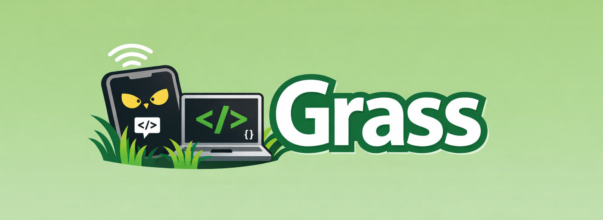

<div align="center">



[](https://www.npmjs.com/package/@gitbot-hq/gitbot)

# gitbot

**Build your bots. Run them on your machine. Talk to them from anywhere.**

Run one command. Scan a QR code. Create bots with their own instructions, setup steps and permissions — then put them to work in your local project directories from any device.

---

[Installation](#installation) · [Quick Start](#quick-start) · [How It Works](#how-it-works) · [Commands](#commands) · [API Reference](#api-reference) · [Contributing](#contributing)

</div>

## What is gitbot?

gitbot is a **bot creation and running program** built on top of Claude Code and other coding harnesses (Opencode, Codex).

A *bot* is a named, reusable agent you define once: a job description that is appended to the harness's own system prompt, an emoji and a name, setup instructions for what it needs on a machine, a default repo, a model, and a permission mode. Once a bot exists, you give it work in *threads* — each thread is a live agent session scoped to a folder, and a bot can have as many as you want.

gitbot spins up a local server that serves the bot hub UI and bridges every thread to a real agent session on your machine — one that reads your files, writes code, and runs commands. The hub runs in your browser, on any device on your network. Your phone, your tablet, whatever.

```
You on the couch          Your laptop
  (phone browser)  <--->  (gitbot server)
       WiFi                bots → threads → Claude Code / Opencode / Codex
                           running in your local project directories
```

No copy-pasting. Just scan and go.

## Installation

```bash
npm install -g @gitbot-hq/gitbot
```

That's it. `gitbot` is now available everywhere.

> [!NOTE]
> gitbot requires **Node.js 18+**. The Claude Code agent requires the `claude` CLI to be installed and authenticated on your machine. The Opencode agent requires the `@opencode-ai/sdk` package. The Codex agent requires the `codex` CLI.

### Build from source

```bash
git clone https://github.com/gitbot-hq/GitBot
cd GitBot

npm install
npm run build      # compiles the CLI and bundles the web UI into dist/ui
npm install -g .
```


## Quick Start

```bash
# Navigate to a workspace directory (parent of your repos, or a specific project)
cd ~/projects

# Start the bot hub
gitbot start -p 3000
```

That's it. You'll see something like:

```
gitbot — starting workspace server in /Users/you/projects
  available agents: claude-code, opencode, codex
  workspace: /Users/you/projects
  port: 3000 (specified)

  Local Network  http://192.168.1.42:3000

  ▄▄▄▄▄▄▄▄▄▄▄▄▄▄▄
  █ ▄▄▄▄▄ █ █ █ █
  █ █   █ █▄█ █ █
  █ ▄▄▄▄▄ █ ▄▄█ █
  ▀▀▀▀▀▀▀▀▀▀▀▀▀▀▀

  Scan to open on your phone
```

Open the URL or scan the QR code. From the hub, create a bot (or pick one of the presets), let it run its setup thread once on this machine, then open a thread against a folder and start prompting.

## How It Works

gitbot runs a single HTTP server that handles everything:

1. **Serves the bot hub UI** — A full-featured React app, embedded directly in the binary. No separate frontend to deploy.
2. **Stores your bots** — Bots and their threads live in a JSON store under your home directory, so they survive restarts and are shared by every workspace on the machine.
3. **Manages a workspace** — gitbot treats the directory where you run `gitbot start` as a workspace. It can list the subdirectories as repos, browse their file trees, read files, and clone new repos into the workspace.
4. **Bridges bots to harnesses** — Each thread creates a real agent session via the Claude Agent SDK (Claude Code), the Opencode SDK, or the Codex CLI, with the bot's instructions appended to the harness's own system prompt. The agent sees your project files, can edit code, run commands — everything it normally does.
5. **Streams events to the UI** — Agent output is delivered via Server-Sent Events (SSE), so the UI receives a live stream of assistant messages, tool calls, permission requests, and status updates.

By default the connection is local: your prompts go from your browser, over your WiFi, to the gitbot server on your machine. Nothing leaves your network (except the agent's own API calls to Anthropic or its configured provider). To reach it from outside your LAN, put it on a private network such as Tailscale.

### Bots carry their own setup

A bot can declare what it needs from a machine — "ffmpeg must be on PATH", "run `npm install` in the repo". The first time that bot lands on a machine, gitbot opens a **setup thread** and lets the bot prepare the machine itself, once. Until that setup is marked complete, the bot will not accept work threads. Setup travels with the bot definition, so a bot shared with someone else knows how to set itself up on their machine too.

### Threads are where the work happens

A thread belongs to one bot and runs in one folder — the folder you pick, else the bot's default repo, else the directory you started gitbot in. Threads are listed, renamed, rejoined and deleted from the hub, and their messages are read back from the harness's own transcript on disk rather than duplicated into gitbot's store.

### Sessions are persistent

Close your browser tab. Your phone dies. The WiFi drops. It doesn't matter — your agent session keeps running on your machine. When you reconnect, you pick up right where you left off. Claude Code session history is loaded from its transcript files on disk; Opencode history is fetched from its local server.

### Permissions are forwarded to you

When the agent wants to do something that needs approval (run a bash command, edit a file, fetch a URL), you'll see a permission prompt right in the chat UI. You approve or deny from your phone. You stay in control.

### Ports

`gitbot start` runs locally and binds port `3000` by default. Pass `-p <port>` to use a different one — handy when several instances run at once in different directories.

---

## Commands

### `gitbot start`

The only command. Starts the bot hub — an HTTP server with SSE event streaming.

```bash
gitbot start [options]
```

| Flag | Description |
|---|---|
| `-p, --port <number>` | Bind this local port and serve the UI at `http://localhost:<port>` (default `3000`) |
| `-l, --local` | Bind a local port. This is the default; the flag is accepted for compatibility |
| `-c, --caffeinate` | Prevent macOS sleep for 8 hours while the server is running |

**Examples:**

```bash
# Default — local server on port 3000, great for a phone on the same WiFi
gitbot start

# A different local port
gitbot start -p 4000

# Keep your Mac awake while your bots work
gitbot start -p 3000 --caffeinate
```

---

## API Reference

gitbot exposes a REST + SSE API. All endpoints return JSON unless noted.

### Workspace & Infrastructure

| Method | Path | Description |
|---|---|---|
| `GET` | `/health` | Returns `{ status: "ok", cwd }` |
| `GET` | `/agents` | Returns `{ agents: string[] }` — list of available agents |
| `GET` | `/repos` | List subdirectories of the workspace as `{ name, path, isGit }[]` |
| `GET` | `/repos/details?repoPath=<path>` | Returns `{ branch, lastCommit, dominantLanguage }` for a specific repo |
| `POST` | `/repos/clone` | Clone a git repo into the workspace. Body: `{ url }`. Returns `{ path, name }` |
| `POST` | `/folders` | Create an empty folder in the workspace. Body: `{ name }`. Returns `{ path, name }` |
| `GET` | `/dir?repoPath=<path>&path=<subpath>` | List directory entries (files and folders) within a repo. Path is validated to stay inside `repoPath`. |
| `GET` | `/file?repoPath=<path>&path=<filePath>` | Read a file. Path is validated to stay inside `repoPath`. 5 MB max. |
| `GET` | `/diffs?repoPath=<path>` | Returns `git diff HEAD` output for a repo as `{ diff }` |

### Bots & Threads

| Method | Path | Description |
|---|---|---|
| `GET` | `/bots` | List all bots |
| `POST` | `/bots` | Create a bot. Body: `{ name, description?, emoji?, agent?, instructions?, setupInstructions?, model?, repoPath?, permissionMode?, allowedTools?, disallowedTools? }`. `agent` is `claude-code` (default), `opencode` or `codex`. Returns `{ bot, setupThread? }` |
| `GET` | `/bots/:id` | Fetch one bot |
| `PATCH` | `/bots/:id` | Update a bot. Returns `{ bot, setupThread? }` |
| `DELETE` | `/bots/:id` | Delete a bot |
| `POST` | `/bots/:id/setup` | Mark this machine's setup. Body: `{ action: "complete" \| "reset" \| "fail" }` |
| `GET` | `/threads?botId=<id>` | List threads, optionally filtered to one bot |
| `POST` | `/threads` | Open a thread. Body: `{ botId, repoPath?, title? }`. Returns `409` with `setupRequired` if the bot has not set up this machine yet |
| `GET` | `/threads/:id` | Fetch one thread |
| `PATCH` | `/threads/:id` | Update a thread (e.g. rename) |
| `DELETE` | `/threads/:id` | Delete a thread |
| `GET` | `/threads/:id/messages` | Message history for a thread, read from the harness transcript |

### Sessions

| Method | Path | Description |
|---|---|---|
| `GET` | `/sessions?agent=<agent>&repoPath=<path>` | List past sessions for a repo and agent |
| `GET` | `/sessions/:id/history?agent=<agent>&repoPath=<path>` | Load message history for a session |
| `GET` | `/sessions/:id/status` | Returns `{ streaming: boolean }` |
| `POST` | `/sessions/:id/abort` | Cancel an in-progress session |
| `POST` | `/sessions/:id/permission` | Respond to a permission request. Body: `{ toolUseID, approved: boolean }` |

### Chat

| Method | Path | Description |
|---|---|---|
| `POST` | `/chat` | Start or continue a session. Body: `{ repoPath, agent, prompt, sessionId? }`. Returns `{ sessionId }` |

### Streaming Events

| Method | Path | Description |
|---|---|---|
| `GET` | `/events?sessionId=<id>` | SSE stream for a specific session. Supports `Last-Event-ID` for reconnect/replay. |
| `GET` | `/permissions/events` | Global SSE stream of all pending permission requests across all active sessions |

#### SSE Event Types (`/events`)

| Event type | Payload fields | Description |
|---|---|---|
| `user_prompt` | `prompt` | The prompt that was sent to the agent |
| `system` | `subtype`, `data` | Agent session initialized |
| `assistant` | `content` | Streaming assistant text |
| `tool_use` | `tool_name`, `tool_input` | Agent is calling a tool |
| `status` | `status`, `tool_name?` | Activity indicator ("thinking", "tool") |
| `permission_request` | `toolUseID`, `toolName`, `input` | Agent is requesting permission |
| `result` | `subtype`, `cost`, `duration_ms`, `num_turns` | Query complete (success or error) |
| `done` | — | Session finished |
| `aborted` | `message` | Session was cancelled |
| `error` | `message` | An error occurred |
| `agent_error` | `message` | Agent-side error (opencode) |

Events include a `seq` field and are delivered with SSE `id:` headers so clients can use `Last-Event-ID` to resume a stream without missing events.

#### SSE Event Types (`/permissions/events`)

| Event type | Payload fields | Description |
|---|---|---|
| `permissions` | `permissions[]` | Full snapshot of all pending permissions across all sessions |

Each permission entry includes `sessionId`, `agent`, `repoPath`, `repoName`, `toolUseID`, `toolName`, and `input`.

---

## Architecture

```
┌─────────────────────────────┐
│  Browser (any device)       │
│  React bot hub UI           │
│  ─ bots + threads           │
│  ─ repo + folder picker     │
│  ─ markdown rendering       │
│  ─ syntax highlighting      │
│  ─ permission modals        │
│  ─ diff viewer              │
│  ─ file browser             │
└──────────┬──────────────────┘
           │ HTTP + SSE
           │ (local port)
┌──────────▼──────────────────┐
│  gitbot Server              │
│  ─ bot + thread store       │
│  ─ workspace management     │
│  ─ session management       │
│  ─ tool permission relay    │
│  ─ SSE event streaming      │
│  ─ repo details + file API  │
└──────┬───────────┬──────────┘
       │           │            │
  Claude SDK   Opencode SDK   Codex CLI
┌──────▼──────┐ ┌──▼──────────┐ ┌▼────────────┐
│ Claude Code │ │  Opencode   │ │   Codex     │
│  harness    │ │  harness    │ │   harness   │
└─────────────┘ └─────────────┘ └─────────────┘
```

### Transport: SSE instead of WebSocket

gitbot uses **Server-Sent Events (SSE)** for streaming, not WebSockets. The client sends requests via regular HTTP POST and receives the response stream via a GET `/events` connection. This means:

- Standard HTTP — works through proxies and most network configurations
- The `Last-Event-ID` header lets clients reconnect and replay any buffered events they missed
- The `/permissions/events` endpoint provides a single global stream for all pending permissions, useful for building dashboard-style UIs that manage multiple sessions at once

### Session Management

Sessions are the core abstraction. A session is created when a `/chat` POST is received, and lives in memory on the server.

- **Persistence** — Sessions survive client disconnects. If the browser closes mid-query, the agent keeps running. When the client reconnects, it can replay buffered events using `Last-Event-ID`.
- **Resumption** — Clients can resume prior sessions by passing `sessionId` to `/chat`. For Claude Code, the SDK resumes from the `.jsonl` transcript file on disk. For Opencode, the SDK resumes from its local session store.
- **Multi-repo** — Each session is scoped to a `repoPath`. The agent runs with that directory as its working directory.
- **Idle cleanup** — Automatic cleanup is currently disabled. Sessions are kept in memory indefinitely (cleanup will be re-enabled once a race-condition-free implementation is ready).
- **Abort** — `POST /sessions/:id/abort` cancels a running session. For Claude Code, this signals an `AbortController`. For Opencode, it calls the SDK abort endpoint and immediately marks the session done.

### Multi-Agent Support

gitbot detects which harnesses are available at startup by checking for the `claude` CLI, the `@opencode-ai/sdk` package, and the `codex` CLI. It reports the available agents at `/agents`. A bot's `model` and `permissionMode` are applied to whichever harness runs its threads.

**Each bot picks its agent.** A bot's `agent` decides which harness runs its threads; the form defaults to the first one installed. A thread stays on the agent that ran its first turn, because a session id only means something to the agent that issued it — switching a bot's agent applies to threads that have not started yet. Chatting with a bot whose agent is not installed returns a 400 with `agentUnavailable`. All three harnesses get the same bot framing (instructions, setup prompt, `SETUP_COMPLETE` / `SETUP_FAILED` markers) from `src/bot-prompt.ts`.

| Bot feature | Claude Code | Opencode | Codex |
|---|---|---|---|
| Instructions | appended to the system prompt | per-message `system` | `developer_instructions` config |
| Resume + thread history | yes | yes | yes |
| Setup runs | yes | yes | yes |
| `allowedTools` — the only tools the bot can use | yes, MCP tools included | yes | **not supported** |
| `disallowedTools` | yes | yes | **not supported** |

`allowedTools` is a restriction, not an auto-approve list: whether a tool needs approval is decided by the permission mode alone. It does not apply to a bot's setup run, which may need tools the job itself never uses. Opencode bots need a `model` in `provider/model` form (e.g. `anthropic/claude-haiku-4-5`); Opencode's free default model refuses requests made through the SDK.

**Claude Code** (`claude-code`): Uses the `@anthropic-ai/claude-agent-sdk` `query()` function. Runs the `claude-opus-4-6` model in `default` permission mode. Supports `canUseTool` for per-tool permission prompts. Session transcripts are stored at `~/.claude/projects/<cwd>/<session-id>.jsonl`.

**Opencode** (`opencode`): Uses the `@opencode-ai/sdk`. gitbot spawns an Opencode server process at startup (or connects to one already running on port 4096). Per-directory clients are maintained so sessions can be scoped to different repos simultaneously. Events are received via a persistent Opencode event stream (`client.event.subscribe()`). If the stream fails, it reconnects automatically after 2 seconds.

**Codex** (`codex`): Uses `@openai/codex-sdk`, which runs the Codex binary bundled with it rather than the `codex` on your PATH; your own install only supplies the login (`codex login`). If the bundled binary cannot be found, gitbot falls back to the `codex` on PATH and logs a warning, since the two versions may differ. Session transcripts are read from `~/.codex/sessions`.

### Repo Details

`GET /repos/details?repoPath=<path>` returns metadata about a git repository without loading its full file tree:

- **`branch`** — current HEAD branch name
- **`lastCommit`** — message, hash, and timestamp of the most recent commit
- **`dominantLanguage`** — the most common file extension in the repo (determined by `git ls-files`, so it respects `.gitignore`)

### File System API

`GET /dir` and `GET /file` provide a sandboxed file browser. Both endpoints validate that the requested path is inside the given `repoPath` before serving anything, preventing path traversal. `readFile` enforces a 5 MB cap.

### Session Titles

When listing Claude Code sessions, gitbot first looks for a `custom-title` entry in the session's `.jsonl` transcript. If found, that title is used as the session preview. Otherwise, it collects text from the first few user and assistant messages to build a ~80-character preview string.

### Web UI

The UI is a Next.js app that lives in [`ui/`](ui/). `npm run build` exports it to static HTML/CSS/JS and copies it into `dist/ui`, so the published package ships a ready-built UI and users need no build step. `gitbot start` serves it from the same port as the API.

Opening `/` sends first-time users (no bots on this machine yet) to `/onboarding`; everyone else lands on the bot hub at `/v2`.

- **Bot hub** — create, edit and delete bots, each with its own mascot and color; per-bot thread lists
- **Onboarding** — first-run flow to make your first bot or import one
- **Bot sharing** — export a bot as a share code and import it on another machine
- **Setup threads** — a bot prepares this machine once, in a thread of its own, before it takes work
- **Folder picker** — choose where a thread runs
- **Live chat** — SSE streaming with activity status, a Stop button, and markdown rendering (`react-markdown` + GFM)
- **Permission prompts** — approve/deny the agent's tool usage from the chat
- **Light/dark theme** toggle (persisted in `localStorage`)

## Project Structure

```
GitBot/
├── src/
│   ├── index.ts           # CLI entrypoint (commander setup)
│   ├── server.ts          # HTTP request routing, session lifecycle
│   ├── server-common.ts   # Shared: HTTP server, SSE, session store, workspace routes
│   ├── start-claude-code.ts  # Claude Code harness integration
│   ├── start-opencode.ts  # Opencode harness integration
│   ├── start-codex.ts     # Codex harness integration
│   ├── bot-prompt.ts      # Bot + setup prompts and setup verdict, shared by all harnesses
│   ├── workspace.ts       # Repo listing, file browser, git details, clone
│   ├── bot-store.ts       # Bot + thread persistence (JSON store)
│   ├── bot-routes.ts      # REST surface for /bots and /threads
│   └── static-ui.ts       # Serves the built web UI from dist/ui
├── ui/                    # Web UI source (Next.js, static export) — not published
├── scripts/
│   └── build-ui.mjs       # Builds ui/ and copies the export into dist/ui
├── dist/                  # Compiled CLI (CommonJS) + dist/ui (built web UI)
├── package.json
└── tsconfig.json
```

## Tech Stack

| Component | Technology |
|---|---|
| Language | TypeScript (CommonJS, ES2020) |
| CLI | Commander v14 |
| Transport | HTTP + Server-Sent Events (SSE) |
| Claude Code | `@anthropic-ai/claude-agent-sdk` |
| Opencode | `@opencode-ai/sdk` |
| Codex | `@openai/codex-sdk` (bundled binary) |
| UI | Next.js 16 static export, React 19, Tailwind v4 |
| Markdown | react-markdown + remark-gfm |
| QR codes | qrcode-terminal |

## Development

```bash
# Full build: CLI (tsc) + web UI (Next.js export -> dist/ui)
npm run build

# CLI only — fast, when you haven't touched ui/
npm run build:cli

# Web UI only
npm run build:ui

# Run the CLI from source (serves the UI from ui/out — run build:ui once first)
npm run dev -- start -p 3000

# Run built version
./dist/index.js start -p 3000
```

The working directory where you run `gitbot start` is treated as the workspace root. Repos are the subdirectories of that workspace. You can run gitbot from any directory — the hub lets you pick the folder a thread runs in. Bots themselves are stored per-machine, not per-workspace.

## Security Considerations

> [!IMPORTANT]
> gitbot has **no authentication**. Anyone who can reach the gitbot port on your network can run your bots on your machine, browse your project files, and read file contents. Bots can be given `auto-approve` permission mode, in which case they act without asking you first.
>
> Run it on trusted networks only, and do not expose the port to the internet.

## Contributing

Contributions are welcome. If you want to help:

1. Fork the repo
2. Create a branch (`git checkout -b my-feature`)
3. Make your changes
4. Run `npm run build` to verify compilation
5. Open a PR

Please keep changes focused and avoid unnecessary refactoring. If you're unsure whether a change fits, open an issue first.

## License

MIT — see [LICENSE](LICENSE) for details.
